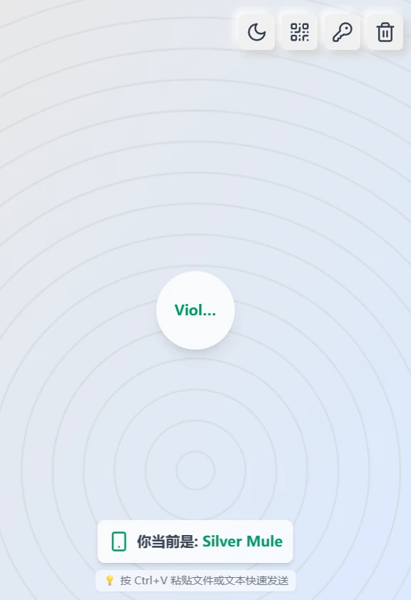
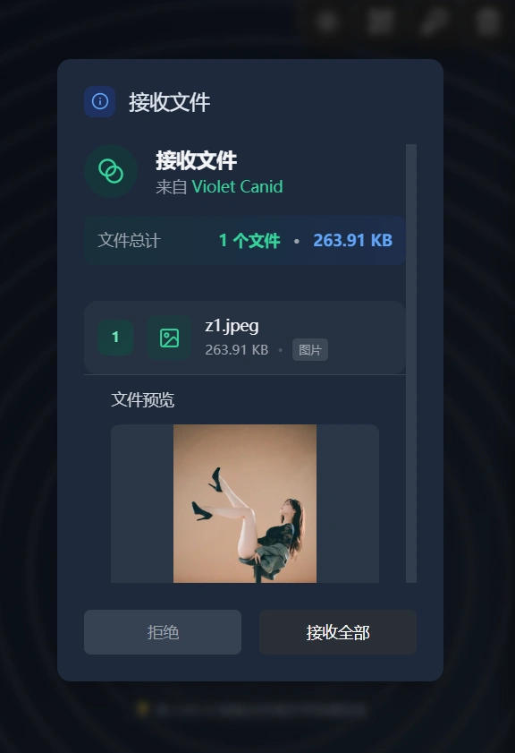

a# 🔗 Web Airdrop

<p align="center">
  <a href="./README.md">中文文档</a>
</p>

<p align="center">
  
  
  
  
</p>

<div style="display: flex; flex-wrap: wrap; gap: 1rem; justify-content: center; align-items: center;">
  
  
</div>

<br />

Browser-based local network file transfer with no server data collection, making browsers great again!!

## ✨ Core Features

🚫 **No App Needed - Works 100% in browser**

#### ⚡ High-Performance Peer-to-Peer Transfer
- **🫗 Streaming Download**: Traditional frontend downloads store all chunks in memory, which can crash with large files
- **⬇️ Unlimited File Size Transfer**: Implements background streaming downloads using Service Worker or File System Access API (browser support required)
- **🔄 Flow Control Mechanism**: Intelligent buffer management to prevent memory overflow and transfer blockage
- **🌐 Direct Connection**: Browser-to-browser direct connections based on WebRTC DataChannel

### 🔄 Smart Resume Transfer
> **Reliability guarantee for large file transfers**

- **🧠 Intelligent Caching**: Generates unique hash identifiers based on filename and file size to ensure accurate resume transfers
- **💾 Local Data Persistence**: Uses IndexedDB to store transfer progress and data blocks, supporting transfer resumption after browser restart
- **🔄 Automatic Negotiation**: Sender and receiver automatically negotiate transfer starting position via WebRTC without manual intervention
- **⚡ Rapid Recovery**: After reconnection, the system automatically detects and continues from the breakpoint, significantly saving transfer time
- **🛡️ Data Integrity Guarantee**: Multiple verification mechanisms ensure the integrity and consistency of resumed data

### 🎯 Convenient File Operations
> **Ultimate user experience design**

- **🖱️ Drag and Drop**: Support for directly dragging files to the browser window, with automatic recognition and transfer preparation
- **📋 Paste to Transfer**: Use `Ctrl + V` shortcut to directly paste files from clipboard, supporting screenshots, copied files, and more
- **📁 Batch Selection**: Support for selecting multiple files for batch transfer to improve work efficiency
- **🔍 File Preview**: Automatically generates file previews and detailed information before transfer to ensure accuracy
- **📊 Real-time Progress**: Precisely displays transfer progress, speed, and remaining time for each file

### 💬 Cross-Device Text Sharing
> **Seamless text transfer experience**

- **📝 Instant Text Transfer**: Supports quick transfer of plain text, rich text, code snippets, and other text formats
- **🔄 Bidirectional Sync**: Any device can send and receive text content, truly enabling cross-device collaboration
- **📋 One-Click Copy**: Received text content can be copied to clipboard with one click for convenient use
- **🎨 Format Preservation**: Maintains original text formatting and encoding, ensuring accurate transfer of special characters and line breaks
- **⚡ Millisecond-Level Transfer**: Extremely low text transfer latency, achieving near real-time cross-device text synchronization

### 📱 QR Code Quick Connection
> **Best connection solution for mobile devices**

- **📲 Scan to Connect**: Automatically generates high-definition QR codes; mobile phones can quickly join transfer sessions by scanning
- **🔄 Dynamic Updates**: QR codes contain complete connection information and support real-time updates of room status
- **📱 Mobile Optimization**: QR code size and recognition algorithms optimized for mobile devices to ensure quick recognition
- **🔒 Secure Encoding**: QR code content is encrypted to prevent malicious interception and forgery
- **⏰ Smart Expiration**: QR codes have time validity and automatically expire to ensure connection security

### 🔢 Room Code Convenient Connection
> **Simple and memorable connection method**

- **🎲 Smart Generation**: Automatically generates 6-digit room codes that are easy to remember and input
- **⏱️ Flexible Validity Period**: Supports customizable room code validity periods, balancing convenience and security
- **🔄 One Code, Multiple Connections**: A single room code supports multiple devices connecting simultaneously for multi-party file sharing
- **📞 Voice Transmission**: Pure numeric design facilitates telephone or voice communication, suitable for various communication scenarios
- **🛡️ Brute Force Protection**: Built-in frequency limits and error count limits to prevent malicious attempts

### 🔄 Smart Auto-Reconnection
> **Stable transfer under network fluctuations**

- **🔍 Real-time Monitoring**: Continuously monitors WebRTC connection status and network quality to promptly detect connection issues
- **⚡ Fast Reconnection**: Automatically attempts to reestablish connections after network interruptions, with average reconnection time under 3 seconds
- **🎯 Intelligent Strategy**: Automatically adjusts reconnection strategy and frequency based on network environment to avoid ineffective attempts
- **💾 State Preservation**: Maintains transfer state and progress information during reconnection to ensure seamless recovery
- **🔔 User Notifications**: Provides clear visual feedback when connection status changes to keep users informed

### 🚀 Other Technical Highlights

#### 🔐 End-to-End Secure Transfer
- **🛡️ WebRTC Native Encryption**: Provides end-to-end encryption protection using DTLS and SRTP protocols
- **🚫 Zero Server Storage**: Files transfer directly between devices; the server stores no user data
- **🔒 Session Isolation**: Each transfer session is independently encrypted to ensure data security isolation

#### 🌍 Cross-Platform Compatibility
- **💻 Desktop Support**: Perfect support for Windows, macOS, Linux, and other mainstream operating systems
- **📱 Mobile Optimization**: Specialized optimization for iOS and Android mobile browsers
- **🌐 Browser Compatibility**: Supports Chrome, Firefox, Safari, Edge, and other mainstream browsers

#### 🎨 Modern User Interface
- **📱 Responsive Design**: Perfect adaptation to various screen sizes, from mobile phones to large displays
- **🌙 Dark Mode**: Supports light and dark theme switching to protect users' vision

---

## 📋 Table of Contents

- [📚 Usage Instructions](#-usage-instructions)
- [🎯 Project Overview](#-project-overview)
- [🏗️ Architecture Design](#️-architecture-design)
- [🔧 Core Technology Analysis](#-core-technology-analysis)
  - [WebRTC Connection Mechanism Explained](#webrtc-connection-mechanism-explained)
  - [Resume Transfer Mechanism In-Depth Analysis](#resume-transfer-mechanism-in-depth-analysis)
- [🛠️ Technology Stack and Dependencies](#️-technology-stack-and-dependencies)
- [❓ Frequently Asked Questions](#-frequently-asked-questions)

---

## 📚 Usage Instructions

### Requirements

- **Node.js**: >= 22.0.0
- **pnpm**: >= 9.7.1
- **Modern Browsers**: Browsers supporting WebRTC (Chrome 60+, Firefox 55+, Safari 14+)

### Installation and Startup

#### Clone the Project

```bash
git clone https://github.com/beixiyo/web-share
cd web-share
```

#### Docker Deployment

```bash
# Build Docker image
# VITE_SERVER_URL_ARG tells the frontend the WebSocket address, if not specified it will be automatically inferred from the current domain
docker build \
  --build-arg VITE_SERVER_URL_ARG=wss://YourHost:YourPort \
  -t web-share .

# Run container
docker run -d \
  --name=web-share \
  -p 7001:3001 \
  -e PORT=3001 \
  --restart=always \
  web-share
```

#### Local Development

```bash
# Install pnpm globally
npm i -g pnpm@9.7.1

# Install project dependencies
pnpm i

# Start development environment (first run needs to be executed twice to build the common package)
pnpm run dev

# Start each service separately
pnpm run dev:server  # Start signaling server
pnpm run dev:client  # Start frontend client
pnpm run dev:common  # Build common type package
```

#### Production Build

```bash
# Build all packages
pnpm run build

# Build separately
pnpm run build:common  # Build common package first
pnpm run build:server  # Build server
pnpm run build:client  # Build client
```

### Basic Usage Flow

#### 🏠 Creating Connections

**Method 1: Room Code Connection**
1. Click the "Generate Room Code" button
2. System generates a 6-digit room code
3. Share the room code with other users
4. Other users enter the room code to join the room

**Method 2: Direct Room Connection**
1. Click "Create Direct Room"
2. System generates a unique room link
3. Share with other devices via QR code or link
4. Scan code or click link to join directly


#### 📁 File Transfer

**Sending Files**:
1. Select files to send (supports multiple file selection), or directly paste with `Ctrl + V`
2. System displays file preview and size information
3. Click "Send Files" button
4. Wait for receiver confirmation

**Receiving Files**:
1. Receive file transfer request
2. View file information and preview
3. Click "Accept" or "Reject"
4. Download starts automatically after acceptance


#### ⚡ Resume Transfer

**Automatic Resume Transfer**:
- System automatically saves progress when transfer is interrupted
- Prompts whether to continue transfer after reconnection
- Supports cleaning expired transfer cache

**Manual Management**:
- Click "Clean Cache" in the toolbar
- Select cleaning strategy (all/expired/failed)
- View cache space usage

### Advanced Features

#### 🔧 Cache Management

The system provides comprehensive cache management functions:

```typescript
/** Clean expired cache (7 days) */
await resumeManager.cleanupExpiredCache(7)

/** Get cache statistics */
const stats = await resumeManager.getCacheStats()

/** Manually clean specific file cache */
await resumeManager.deleteResumeCache(fileHash)
```

#### 📊 Transfer Monitoring

Real-time monitoring of transfer status and performance:

- **Transfer Speed**: Real-time display of current transfer speed
- **Remaining Time**: Estimated time to complete transfer
- **Error Retry**: Automatic retry of failed transfers
- **Connection Status**: Display of WebRTC connection quality

#### 🛠️ Debugging Tools

Debugging features available in development environment:

- **Console Logs**: Detailed transfer logs
- **Network Status**: WebRTC connection statistics
- **Performance Monitoring**: Memory and CPU usage

---

## 🛠️ Technology Stack and Dependencies

### Frontend Technology Stack

#### 🎨 Core Framework
- **Vue 3.5.13**: Progressive JavaScript framework
- **TypeScript 5.7.2**: Static type checking
- **Vite**: Modern build tool
- **Vue Router 4.4.5**: Single-page application routing

#### 🎯 UI and Styling
- **UnoCSS**: Atomic CSS engine
- **Tailwind CSS**: Utility-first CSS framework
- **Lucide Vue Next**: Modern icon library

#### 🔧 Utility Libraries
- **@jl-org/tool**: General utility function library
- **LocalForage**: Client-side storage solution
- **QRCode**: QR code generation library

### Backend Technology Stack

#### 🌐 Server Framework
- **Express 5.1.0**: Web application framework
- **WebSocket (ws 8.18.2)**: WebSocket server
- **Connect History API Fallback**: SPA routing support

#### 🔧 Utility Libraries
- **UA Parser JS**: User agent parsing
- **Unique Names Generator**: Random name generation

### Development Tools

#### 📦 Package Management
- **pnpm**: Efficient package manager
- **Monorepo**: Multi-package management architecture

#### 🔍 Code Quality
- **ESLint**: Code checking tool
- **@antfu/eslint-config**: ESLint configuration preset

---

## ❓ Frequently Asked Questions

### 🔧 Technical Issues

**Q: What to do if WebRTC connection fails?**

A: Common solutions:
1. Try closing all browser plugins or use incognito mode
2. Check if your browser supports WebRTC
3. Check network environment, ensure you're not behind strict NAT or firewall

**Q: Resume transfer not working?**

A: Troubleshooting steps:
1. Check if browser storage space is sufficient
2. Confirm LocalForage initialization was successful
3. Verify file hash generation consistency
4. Check console for cache-related errors

### 🚀 Deployment Issues

**Q: Cannot connect after Docker deployment?**

A: Checklist:
1. Ensure WebSocket server URL configuration is correct
2. Check port mapping is correct
3. Verify firewall settings
4. Confirm HTTPS/WSS certificate configuration

### 📱 Compatibility Issues

**Q: Mobile browser compatibility?**

A: Support status:
- ✅ Chrome Mobile 60+
- ✅ Safari Mobile 14+
- ✅ Firefox Mobile 55+
- ❌ WeChat built-in browser (some features limited)

**Q: File size limitations?**

A: Limitation details:
- Theoretically no size limit, modern browsers can support my streaming transfer
- Supports multiple file batch transfer

### 🔒 Security Issues

**Q: Is file transfer secure?**

A: Security guarantees:
1. WebRTC provides end-to-end encryption
2. Files do not pass through server storage
3. Can disconnect from signaling server after connection is established
4. Supports room code expiration mechanism

---

## 🎯 Project Overview

### Feature Introduction

**WebRTC File Transfer System** is a peer-to-peer file transfer solution built on modern Web technologies. The project implements the following core functions:

- 🔗 **Peer-to-Peer Direct Transfer**: Uses WebRTC technology to implement direct connections between browsers, no need for files to pass through servers
- 📱 **Cross-Platform Support**: Supports desktop and mobile browsers, enabling seamless file transfer between devices
- ⚡ **Resume Transfer**: Supports resuming transfer after interruption, improving reliability for large file transfers
- 🏠 **Room Mechanism**: Supports creating room codes or direct rooms, facilitating file sharing between multiple devices
- 🔒 **Secure Transfer**: End-to-end encryption based on WebRTC, ensuring file transfer security
- 📊 **Real-time Progress**: Provides detailed transfer progress display and status management

### Technical Highlights

1. **🎨 Modern Architecture**: Uses Monorepo architecture, clearly separating client, server, and common code
2. **⚡ High-Performance Transfer**: Uses WebRTC DataChannel for high-speed file transfer
3. **🔄 Smart Resume Transfer**: File hash-based resume transfer mechanism, supporting interrupted transfer recovery
4. **📱 Responsive Design**: Fully responsive user interface, adapting to various device screens
5. **🛡️ Type Safety**: Comprehensive use of TypeScript, providing complete type definitions and checking
6. **🔧 Extensibility**: Modular design, easy to extend and maintain

### Architecture Overview

```
┌─────────────────┐    WebSocket     ┌─────────────────┐
│   Client A      │◄────────────────►│   Signal Server │
│                 │                  │                 │
│  ┌─────────────┐│                  │  ┌─────────────┐│
│  │ Vue3 + TS   ││                  │  │ Express +   ││
│  │ WebRTC      ││                  │  │ WebSocket   ││
│  │ LocalForage ││                  │  │ Server      ││
│  └─────────────┘│                  │  └─────────────┘│
└─────────────────┘                  └─────────────────┘
         │                                    ▲
         │                                    │
         │          WebRTC P2P                │
         │         DataChannel                │
         ▼                                    │
┌─────────────────┐    WebSocket     ┌───────┴─────────┐
│   Client B      │◄─────────────────┤                 │
│                 │                  │                 │
```

<div align="center">

**🌟 If this project helps you, please give it a ⭐ Star!**

---

**📧 Contact Me**

For questions or suggestions, feel free to contact:

[](mailto:2662442385@qq.com)

---

**📄 License**

This project is licensed under the [MIT License](LICENSE)

</div>
