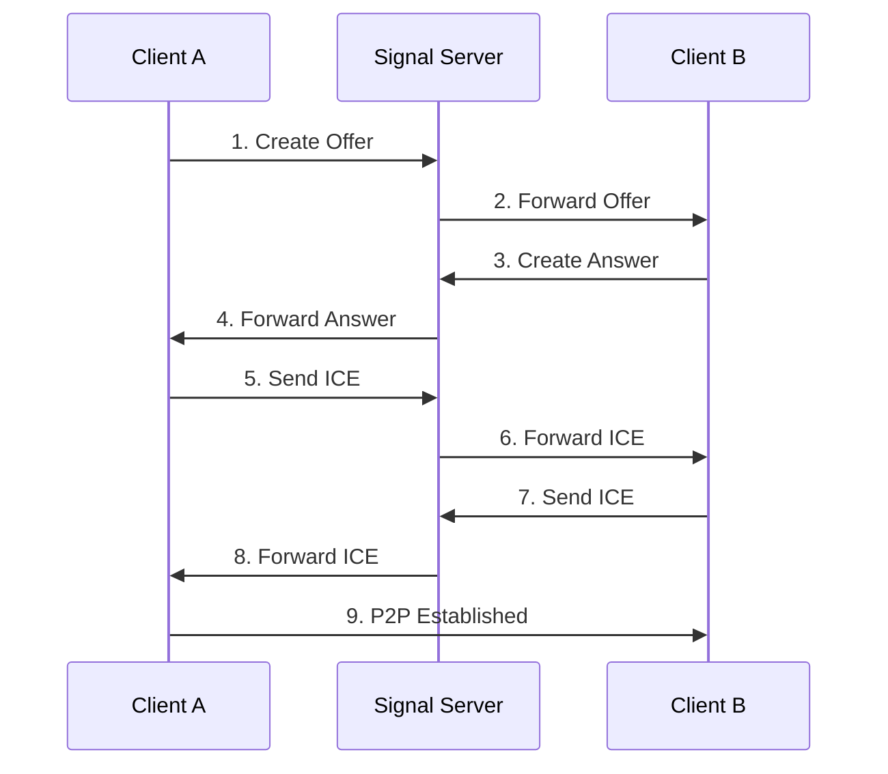
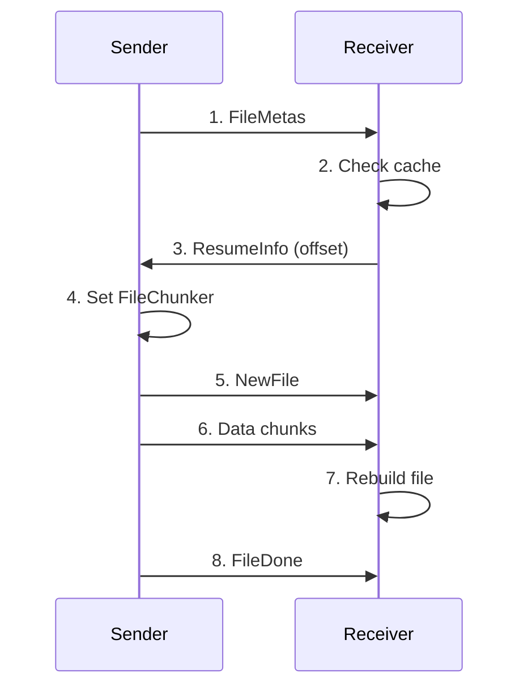

# 🔗 Web Airdrop

<p align="center">
  <a href="./README.EN.md">English</a>
</p>

<p align="center">
  
  
  
  
  
  
</p>

<div style="display: flex; flex-wrap: wrap; gap: 1rem; justify-content: center; align-items: center;">
  
  
</div>

<br />

Enable **LAN** file transfer directly in browsers, no server collects information, making browsers great again!!

## ✨ Core Feature Highlights

🚫 **No app installation required, runs purely in browser**
  - 🖱️ Drag-and-drop file transfer
  - 📋 Paste file transfer
  - 🖼️ File preview
  - 🔢 Room QRCode connection
  - 🔑 End-to-end encryption

#### ⚡ High-performance P2P transfer
- **🫗 Streaming download**: Traditional frontend downloads require saving all chunks to memory, large transfers may crash
- **⬇️ Unlimited file size transfer**: Uses Service Worker or File System Access API for background streaming download (requires browser support)
- **🔄 Flow control mechanism**: Intelligent buffer management prevents memory overflow and transfer blockage
- **🌐 Direct connection**: Browser-to-browser direct connection via WebRTC DataChannel

### 🔄 Smart Resume Transfer
> **Reliable solution for large file transfers**

- **🧠 Smart caching**: Generates unique hash IDs based on filename + file size for accurate resume
- **💾 Local persistence**: Uses IndexedDB to store transfer progress and data chunks, survives browser restarts
- **🔄 Auto-negotiation**: Sender/receiver automatically negotiate resume position via WebRTC
- **⚡ Instant resume**: Reconnects and continues from breakpoint, saving significant time
- **🛡️ Data integrity**: Multiple verification mechanisms ensure consistency

### 🎯 Convenient File Operations
> **Ultimate UX design**

- **🖱️ Drag-to-send**: Drag files directly into browser window
- **📋 Paste transfer**: Use `Ctrl + V` to paste files from clipboard
- **📁 Batch selection**: Transfer multiple files simultaneously
- **🔍 File preview**: Auto-generates previews before transfer
- **📊 Real-time progress**: Shows transfer speed and ETA

### 💬 Cross-device Text Sharing
> **Seamless text transfer**

- **📝 Instant transfer**: Supports plain/rich text, code snippets
- **🔄 Bidirectional sync**: Any device can send/receive
- **📋 One-click copy**: Easy clipboard integration
- **🎨 Format preservation**: Maintains original formatting
- **⚡ Millisecond transfer**: Near real-time sync

### 📱 QR Code Quick Connect
> **Best solution for mobile**

- **📲 Scan-to-connect**: Auto-generates HD QR codes
- **🔄 Dynamic updates**: QR codes contain real-time room status
- **📱 Mobile optimized**: Optimized QR size/recognition
- **🔒 Secure encoding**: Encrypted QR content
- **⏰ Smart expiration**: Auto-expires for security

### 🔢 Room Code Connection
> **Simple memorable connection**

- **🎲 Smart generation**: 6-digit room codes
- **🔄 Multi-connect**: Single code for multiple devices
- **📞 Voice-friendly**: Numbers easy to communicate

### 🚀 Other Technical Highlights

#### 🔐 End-to-end Encryption
- **🛡️ WebRTC native encryption**: DTLS/SRTP protocols
- **🚫 Zero server storage**: Files transfer directly
- **🔒 Session isolation**: Independent encryption per transfer

#### 🌍 Cross-platform Compatibility
- **💻 Desktop support**: Windows/macOS/Linux
- **📱 Mobile optimized**: iOS/Android browsers
- **🌐 Browser support**: Chrome/Firefox/Safari/Edge

#### 🎨 Modern UI
- **📱 Responsive design**: Adapts to all screen sizes
- **🌙 Dark mode**: Eye-friendly themes

---

## 📋 Table of Contents

- [📚 Usage Guide](#-usage-guide)
- [🎯 Project Overview](#-project-overview)
- [🏗️ Architecture](#️-architecture)
- [🔧 Technical Deep Dive](#-technical-deep-dive)
  - [WebRTC Connection Mechanism](#webrtc-connection-mechanism)
  - [Resume Transfer Mechanism](#resume-transfer-mechanism)
- [🛠️ Tech Stack](#️-tech-stack)
- [❓ FAQ](#-faq)

---

## 📚 Usage Guide

### Requirements

- **Node.js**: >= 22.0.0
- **pnpm**: >= 9.7.1
- **Modern browsers**: WebRTC supported (Chrome 60+, Firefox 55+, Safari 14+)

### Installation

#### Clone Project

```bash
git clone https://github.com/beixiyo/web-share
cd web-share
```

#### Docker Deployment

```bash
# start
docker compose up -d
# remove and stop
docker compose down
```

#### Local Development

```bash
# Install pnpm globally
npm i -g pnpm@9.7.1

# Install dependencies
pnpm i

# Start dev (run twice first time to build common package)
pnpm run dev

# Start services individually
pnpm run dev:server  # Signaling server
pnpm run dev:client  # Frontend client
pnpm run dev:common  # Build common types
```

#### Production Build

```bash
# Build all
pnpm run build

# Build individually
pnpm run build:common  # Build common package first
pnpm run build:server  # Server build
pnpm run build:client  # Client build
```

### Basic Usage

#### 🏠 Create Connection

**Method 1: Room Code**
1. Click "Generate Room Code"
2. Share 6-digit code
3. Others enter code to join

**Method 2: Direct Link**
1. Click "Create Direct Room"
2. Share QR code/link
3. Scan/click to join

#### 📁 File Transfer

**Send Files**:
1. Select files (or `Ctrl + V` paste)
2. Preview files
3. Click "Send"
4. Wait for receiver confirmation

**Receive Files**:
1. Receive transfer request
2. Preview file info
3. Accept/decline
4. Auto-download on accept

#### ⚡ Resume Transfer

**Auto-resume**:
- Saves progress automatically
- Prompts to continue after reconnect
- Supports cache cleanup

**Manual Management**:
- Click "Clear Cache" in toolbar
- Select cleanup policy (all/expired/failed)
- View cache usage

### Advanced Features

#### 🔧 Cache Management

```typescript
/** Clean expired cache (7 days) */
await resumeManager.cleanupExpiredCache(7)

/** Get cache stats */
const stats = await resumeManager.getCacheStats()

/** Manual cache cleanup */
await resumeManager.deleteResumeCache(fileHash)
```

#### 📊 Transfer Monitoring

Real-time stats:
- Transfer speed
- ETA
- Error retries
- Connection quality

#### 🛠️ Debug Tools

Dev environment features:
- Detailed logs
- Network stats
- Performance metrics

---

## 🛠️ Tech Stack

### Frontend

#### 🎨 Core Frameworks
- **Vue 3.5.13**
- **TypeScript 5.7.2**
- **Vite**
- **Vue Router 4.4.5**

#### 🎯 UI/Styling
- **UnoCSS**
- **Tailwind CSS**
- **Lucide Vue Next**

#### 🔧 Utilities
- **@jl-org/tool**
- **LocalForage**
- **QRCode**

### Backend

#### 🌐 Server
- **Express 5.1.0**
- **WebSocket (ws 8.18.2)**
- **Connect History API Fallback**

#### 🔧 Utilities
- **UA Parser JS**
- **Unique Names Generator**

### Dev Tools

#### 📦 Package Management
- **pnpm**
- **Monorepo**

#### 🔍 Code Quality
- **ESLint**
- **@antfu/eslint-config**

---

## ❓ FAQ

### 🔧 Technical Issues

**Q: WebRTC connection fails?**
A: Try:
1. Disable browser extensions/use incognito
2. Check browser support
3. Check network/NAT settings

**Q: Resume not working?**
A: Check:
1. Browser storage space
2. LocalForage initialization
3. File hash consistency
4. Console errors

### 🚀 Deployment

**Q: Docker deployment issues?**
A: Verify:
1. WebSocket URL config
2. Port mapping
3. Firewall settings
4. HTTPS/WSS certificates

### 📱 Compatibility

**Q: Mobile browser support?**
A: Supported:
- ✅ Chrome Mobile 60+
- ✅ Safari Mobile 14+
- ✅ Firefox Mobile 55+
- ❌ WeChat browser (limited)

**Q: File size limits?**
A: Theoretically unlimited with streaming

### 🔒 Security

**Q: Is transfer secure?**
A: Yes:
1. WebRTC end-to-end encryption
2. No server storage
3. Session isolation
4. Room code expiry

---

## 🎯 Project Overview

### Features

**WebRTC File Transfer** enables:

- 🔗 **P2P direct transfer**
- 📱 **Cross-platform support**
- ⚡ **Resume interrupted transfers**
- 🏠 **Room-based sharing**
- 🔒 **Encrypted transfers**
- 📊 **Real-time progress**

### Technical Highlights

1. **🎨 Modern architecture**: Monorepo structure
2. **⚡ High performance**: WebRTC DataChannel
3. **🔄 Smart resume**: File hash-based
4. **📱 Responsive UI**: All screen sizes
5. **🛡️ Type safety**: Full TypeScript
6. **🔧 Extensible**: Modular design

### Architecture

```
┌─────────────────┐    WebSocket     ┌─────────────────┐
│   Client A      │◄────────────────►│   Signal Server │
│                 │                  │                 │
│  ┌─────────────┐│                  │  ┌─────────────┐│
│  │ Vue3 + TS   ││                  │  │ Express +   ││
│  │ WebRTC      ││                  │  │ WebSocket   ││
│  │ LocalForage ││                  │  │ Server      ││
│  └─────────────┘│                  │  └─────────────┘│
└─────────────────┘                  └─────────────────┘
         │                                    ▲
         │                                    │
         │          WebRTC P2P                │
         │         DataChannel                │
         ▼                                    │
┌─────────────────┐    WebSocket     ┌───────┴─────────┐
│   Client B      │◄─────────────────┤                 │
│                 │                  │                 │
│  ┌─────────────┐│                  │                 │
│  │ Vue3 + TS   ││                  │                 │
│  │ WebRTC      ││                  │                 │
│  │ LocalForage ││                  │                 │
│  └─────────────┘│                  │                 │
└─────────────────┘                  └─────────────────┘
```

---

## 🏗️ Architecture

### Structure

```
web-share/
├── packages/
│   ├── client/          # Frontend
│   │   ├── src/
│   │   │   ├── ClientServer/     # WebRTC
│   │   │   ├── utils/           # Utilities
│   │   │   ├── views/           # Pages
│   │   │   └── components/      # Components
│   │   └── package.json
│   ├── server/          # Signaling
│   │   ├── src/
│   │   │   ├── WSServer.ts      # WebSocket
│   │   │   └── main.ts          # Entry
│   │   └── package.json
│   └── common/          # Shared
│       ├── src/
│       │   ├── action.ts        # Actions
│       │   ├── RTCData.ts       # WebRTC
│       │   └── message.ts       # Messages
│       └── package.json
└── package.json         # Root
```

### Core Modules

#### 📦 client - Frontend

**Responsibilities**:
- UI/UX
- WebRTC management
- File transfer logic
- Resume cache

**Components**:
- `RTCPeer`: WebRTC connection
- `FileSendManager`: Sender
- `FileDownloadManager`: Receiver
- `ResumeManager`: Resume logic

#### 🌐 server - Signaling

**Responsibilities**:
- WebRTC signaling
- Room management
- Connection state
- Heartbeat

**Features**:
- WebSocket management
- Room code generation
- Reconnect handling
- Message routing

#### 📋 common - Shared

**Responsibilities**:
- Type definitions
- Constants
- Message protocols

**Contents**:
- Action enums
- WebRTC types
- File transfer types
- Resume data

---

## 🔧 Technical Deep Dive

### WebRTC Connection Mechanism

#### 🔄 Connection Flow

**1. Initialization**
```typescript
private initialize(): void {
  this.pc = new RTCPeerConnection({
    iceServers: this.config.iceServers,
  })

  this.pc.ondatachannel = this.onDataChannel
  this.pc.onicecandidate = this.onIceCandidate
  this.pc.onconnectionstatechange = this.onConnectionStateChange
}
```

**2. Signaling**



**3. Key Steps**

**Step 1: Create Offer**
- Generates SDP Offer
- Sends via signaling server

**Step 2: Handle Answer**
- Processes remote SDP Answer
- Begins ICE exchange

**Step 3: ICE Exchange**
- Gathers network candidates
- Establishes optimal path

**Step 4: Data Channel**
- Opens transfer channel
- Begins file transfer

#### 🔧 Signaling Server Role

1. **SDP relay**: Forwards Offers/Answers
2. **ICE relay**: Shares connection candidates
3. **Room management**: Tracks connections
4. **Health monitoring**: Checks connection status

#### 📡 Data Channel

```typescript
const channelOptions = {
  ordered: true,
  maxRetransmits: 3,
}

if (this.channel.bufferedAmount > threshold) {
  await this.waitUntilChannelIdle()
}
```

**Flow Control**:
- Monitors `bufferedAmount`
- Implements backpressure
- Supports pause/resume

---

### Resume Transfer Mechanism

#### 🏗️ Architecture

Components:
1. **ResumeManager**: Cache
2. **FileSendManager**: Sender logic
3. **FileDownloadManager**: Receiver logic
4. **WebRTC**: Offset negotiation

#### 🔍 Code Flow Tags

Key positions marked with `@number. description` format

**How to view**:

1. **Use VSCode Todo Tree Enhanced**:
   - Configured in `.vscode/settings.json`
   - View in "TODO TREE Enhanced" panel
   - Click to navigate

2. **Manual search**:
   - Search for `@01.` `@02.` etc.

#### 🔄 Offset Negotiation



#### 💾 Cache Management

**Data Structure**:

```typescript
interface ResumeCacheItem {
  fileHash: string
  fileName: string
  fileSize: number
  chunks: ArrayBuffer[]
  downloadedBytes: number
  createdAt: number
  updatedAt: number
}
```

**Operations**:
- `createResumeCache()`
- `appendChunk()`
- `getResumeInfo()`
- `deleteResumeCache()`
- `cleanupExpiredCache()`

#### ⚠️ Error Handling

**Fallback**:

```typescript
try {
  const cachedChunks = await this.resumeManager.getCachedChunks(fileHash)
}
catch (error) {
  await this.resumeManager.deleteResumeCache(fileHash)
}
```

Ensures basic transfer works even if resume fails.

---

<div align="center">

**🌟 If you find this useful, give it a ⭐!**

---

**📧 Contact**

[](mailto:2662442385@qq.com)

</div>
