# 🚀 WebRTC 文件传输系统技术文档


---

## 📋 目录

- [📚 使用说明](#-使用说明)
- [🎯 项目概述](#-项目概述)
- [🏗️ 架构设计](#️-架构设计)
- [🔧 核心技术解析](#-核心技术解析)
  - [WebRTC 连接机制详解](#webrtc-连接机制详解)
  - [断点续传机制深度解析](#断点续传机制深度解析)
- [📚 使用说明](#-使用说明)
- [🛠️ 技术栈和依赖](#️-技术栈和依赖)
- [❓ 常见问题](#-常见问题)

---

## 📚 使用说明

### 环境要求

- **Node.js**: >= 22.0.0
- **pnpm**: >= 9.7.1
- **现代浏览器**: 支持 WebRTC 的浏览器（Chrome 60+, Firefox 55+, Safari 14+）

### 安装和启动

#### 1. 克隆项目

```bash
git clone <repository-url>
cd web-share
```

#### 2. 安装依赖

```bash
# 全局安装 pnpm
npm i -g pnpm@9.7.1

# 安装项目依赖
pnpm i
```

#### 3. 本地开发

```bash
# 启动开发环境（首次运行需要执行两次，构建 common 包）
pnpm run dev

# 分别启动各个服务
pnpm run dev:server  # 启动信令服务器
pnpm run dev:client  # 启动前端客户端
pnpm run dev:common  # 构建公共类型包
```

#### 4. 生产构建

```bash
# 构建所有包
pnpm run build

# 分别构建
pnpm run build:common  # 先构建公共包
pnpm run build:server  # 构建服务器
pnpm run build:client  # 构建客户端
```

#### 5. Docker 部署

```bash
# 构建 Docker 镜像
docker build \
  --build-arg VITE_SERVER_URL_ARG=ws://YourHost:YourPort \
  -t web-share .

# 运行容器
docker run -d \
  --name=web-share \
  -p 7001:3001 \
  -e PORT=3001 \
  --restart=always \
  web-share
```

### 基本使用流程

#### 🏠 创建连接

**方式一：房间码连接**
1. 点击"生成房间码"按钮
2. 系统生成 6 位数字房间码
3. 将房间码分享给其他用户
4. 其他用户输入房间码加入房间

**方式二：直连房间**
1. 点击"创建直连房间"
2. 系统生成唯一房间链接
3. 通过二维码或链接分享给其他设备
4. 扫码或点击链接直接加入


#### 📁 文件传输

**发送文件**：
1. 选择要发送的文件（支持多文件选择）
2. 系统显示文件预览和大小信息
3. 点击"发送文件"按钮
4. 等待接收方确认

**接收文件**：
1. 接收到文件传输请求
2. 查看文件信息和预览图
3. 点击"接受"或"拒绝"
4. 接受后自动开始下载


#### ⚡ 断点续传

**自动断点续传**：
- 传输中断后，系统自动保存进度
- 重新连接后，提示是否继续传输
- 支持清理过期的传输缓存

**手动管理**：
- 在工具栏中点击"清理缓存"
- 选择清理策略（全部/过期/失败）
- 查看缓存占用空间

### 高级功能

#### 🔧 缓存管理

系统提供了完善的缓存管理功能：

```typescript
/** 清理过期缓存（7天） */
await resumeManager.cleanupExpiredCache(7)

/** 获取缓存统计信息 */
const stats = await resumeManager.getCacheStats()

/** 手动清理指定文件缓存 */
await resumeManager.deleteResumeCache(fileHash)
```

#### 📊 传输监控

实时监控传输状态和性能：

- **传输速度**：实时显示当前传输速度
- **剩余时间**：预估传输完成时间
- **错误重试**：自动重试失败的传输
- **连接状态**：显示 WebRTC 连接质量

#### 🛠️ 调试工具

开发环境下提供调试功能：

- **控制台日志**：详细的传输日志
- **网络状态**：WebRTC 连接统计
- **性能监控**：内存和 CPU 使用情况

---

## 🛠️ 技术栈和依赖

### 前端技术栈

#### 🎨 核心框架
- **Vue 3.5.13**: 渐进式 JavaScript 框架
- **TypeScript 5.7.2**: 静态类型检查
- **Vite**: 现代化构建工具
- **Vue Router 4.4.5**: 单页应用路由

#### 🎯 UI 和样式
- **UnoCSS**: 原子化 CSS 引擎
- **Tailwind CSS**: 实用优先的 CSS 框架
- **Lucide Vue Next**: 现代图标库
- **Class Variance Authority**: 组件变体管理

#### 🔧 工具库
- **@jl-org/tool**: 通用工具函数库
- **LocalForage**: 客户端存储解决方案
- **QRCode**: 二维码生成库

### 后端技术栈

#### 🌐 服务器框架
- **Express 5.1.0**: Web 应用框架
- **WebSocket (ws 8.18.2)**: WebSocket 服务器
- **Connect History API Fallback**: SPA 路由支持

#### 🔧 工具库
- **UA Parser JS**: 用户代理解析
- **Unique Names Generator**: 随机名称生成

### 开发工具

#### 📦 包管理
- **pnpm**: 高效的包管理器
- **Monorepo**: 多包管理架构

#### 🔍 代码质量
- **ESLint**: 代码检查工具
- **@antfu/eslint-config**: ESLint 配置预设

#### 🏗️ 构建工具
- **Vite**: 开发服务器和构建工具
- **TypeScript Compiler**: 类型检查和编译
- **TSC Alias**: 路径别名解析

### 关键依赖说明

#### WebRTC 相关
```json
{
  "原生 WebRTC API": "浏览器内置",
  "用途": "点对点连接和数据传输"
}
```

#### 文件处理
```json
{
  "@jl-org/tool": "^2.1.3",
  "功能": "文件分片、压缩、流式下载"
}
```

#### 数据存储
```json
{
  "localforage": "1.10.0",
  "功能": "断点续传缓存存储"
}
```

#### 类型定义
```json
{
  "web-share-common": "workspace:*",
  "功能": "跨包类型共享"
}
```

---

## ❓ 常见问题

### 🔧 技术问题

**Q: WebRTC 连接失败怎么办？**

A: 常见解决方案：
1. 尝试关闭所有浏览器插件，或者开无痕
2. 验证 STUN 服务器配置是否正确
3. 尝试使用 TURN 服务器进行中继连接
4. 检查浏览器是否支持 WebRTC
5. 检查网络环境，确保不在严格的 NAT 或防火墙后

**Q: 断点续传不工作？**

A: 排查步骤：
1. 检查浏览器存储空间是否充足
2. 确认 LocalForage 初始化成功
3. 验证文件哈希生成是否一致
4. 查看控制台是否有缓存相关错误

### 🚀 部署问题

**Q: Docker 部署后无法连接？**

A: 检查清单：
1. 确保 WebSocket 服务器 URL 配置正确
2. 检查端口映射是否正确
3. 验证防火墙设置
4. 确认 HTTPS/WSS 证书配置

### 📱 兼容性问题

**Q: 移动端浏览器兼容性？**

A: 支持情况：
- ✅ Chrome Mobile 60+
- ✅ Safari Mobile 14+
- ✅ Firefox Mobile 55+
- ❌ 微信内置浏览器（部分功能受限）

**Q: 文件大小限制？**

A: 限制说明：
- 理论上无大小限制，现代浏览器可以支持我写的流式传输
- 实际受设备内存和存储空间限制
- 支持多文件批量传输

### 🔒 安全问题

**Q: 文件传输是否安全？**

A: 安全保障：
1. WebRTC 提供端到端加密
2. 文件不经过服务器存储
3. 连接建立后即可断开信令服务器
4. 支持房间码过期机制

**Q: 如何防止恶意文件传输？**

A: 防护措施：
1. 文件类型检查和过滤
2. 文件大小限制
3. 传输前预览确认
4. 用户主动接受机制

---

## 🎉 总结

WebRTC 文件传输系统是一个功能完善、技术先进的点对点文件传输解决方案。通过精心设计的架构和实现，它提供了：

- 🚀 **高性能**：基于 WebRTC 的直连传输
- 🔄 **高可靠**：智能断点续传机制
- 🛡️ **高安全**：端到端加密保护
- 📱 **高兼容**：跨平台设备支持

该项目不仅解决了传统文件传输的痛点，还为 WebRTC 技术在文件传输领域的应用提供了优秀的实践案例。

### 🌟 项目特色

1. **创新的断点续传设计**：基于文件哈希的缓存机制，支持跨会话的传输恢复
2. **完善的错误处理**：多层次的容错机制，确保传输的稳定性
3. **优秀的用户体验**：直观的界面设计，简单的操作流程
4. **强大的扩展性**：模块化的架构设计，便于功能扩展和维护

---

## 🎯 项目概述

### 功能介绍

**WebRTC 文件传输系统** 是一个基于现代 Web 技术构建的点对点文件传输解决方案。该项目实现了以下核心功能：

- 🔗 **点对点直连传输**：利用 WebRTC 技术实现浏览器间的直接连接，无需文件经过服务器
- 📱 **跨平台支持**：支持桌面端和移动端浏览器，实现设备间无缝文件传输
- ⚡ **断点续传**：支持传输中断后的断点续传功能，提高大文件传输的可靠性
- 🏠 **房间机制**：支持创建房间码或直连房间，方便多设备间的文件共享
- 🔒 **安全传输**：基于 WebRTC 的端到端加密，确保文件传输安全
- 📊 **实时进度**：提供详细的传输进度显示和状态管理

### 技术亮点

1. **🎨 现代化架构**：采用 Monorepo 架构，清晰分离客户端、服务端和公共代码
2. **⚡ 高性能传输**：利用 WebRTC DataChannel 实现高速文件传输
3. **🔄 智能断点续传**：基于文件哈希的断点续传机制，支持传输中断恢复
4. **📱 响应式设计**：完全响应式的用户界面，适配各种设备屏幕
5. **🛡️ 类型安全**：全面使用 TypeScript，提供完整的类型定义和检查
6. **🔧 可扩展性**：模块化设计，易于扩展和维护

### 架构概览

```
┌─────────────────┐    WebSocket     ┌─────────────────┐
│   Client A      │◄────────────────►│   Signal Server │
│                 │                  │                 │
│  ┌─────────────┐│                  │  ┌─────────────┐│
│  │ Vue3 + TS   ││                  │  │ Express +   ││
│  │ WebRTC      ││                  │  │ WebSocket   ││
│  │ LocalForage ││                  │  │ Server      ││
│  └─────────────┘│                  │  └─────────────┘│
└─────────────────┘                  └─────────────────┘
         │                                    ▲
         │                                    │
         │          WebRTC P2P                │
         │         DataChannel                │
         ▼                                    │
┌─────────────────┐    WebSocket     ┌───────┴─────────┐
│   Client B      │◄─────────────────┤                 │
│                 │                  │                 │
│  ┌─────────────┐│                  │                 │
│  │ Vue3 + TS   ││                  │                 │
│  │ WebRTC      ││                  │                 │
│  │ LocalForage ││                  │                 │
│  └─────────────┘│                  │                 │
└─────────────────┘                  └─────────────────┘
```

---

## 🏗️ 架构设计

### 项目结构

```
web-share/
├── packages/
│   ├── client/          # 前端客户端
│   │   ├── src/
│   │   │   ├── ClientServer/     # WebRTC 连接管理
│   │   │   ├── utils/           # 工具函数和文件处理
│   │   │   ├── views/           # 页面组件
│   │   │   └── components/      # 通用组件
│   │   └── package.json
│   ├── server/          # 信令服务器
│   │   ├── src/
│   │   │   ├── WSServer.ts      # WebSocket 服务器
│   │   │   └── main.ts          # 服务器入口
│   │   └── package.json
│   └── common/          # 公共类型定义
│       ├── src/
│       │   ├── action.ts        # 动作类型定义
│       │   ├── RTCData.ts       # WebRTC 数据类型
│       │   └── message.ts       # 消息类型定义
│       └── package.json
└── package.json         # 根配置文件
```

### 核心模块说明

#### 📦 packages/client - 前端客户端

**主要职责**：
- 用户界面展示和交互
- WebRTC 连接管理
- 文件传输逻辑处理
- 断点续传缓存管理

**核心组件**：
- `RTCPeer`: WebRTC 对等连接管理
- `FileSendManager`: 文件发送管理器
- `FileDownloadManager`: 文件下载管理器
- `ResumeManager`: 断点续传管理器

#### 🌐 packages/server - 信令服务器

**主要职责**：
- WebRTC 信令中继
- 房间管理和用户匹配
- 连接状态维护
- 心跳检测

**核心功能**：
- WebSocket 连接管理
- 房间码生成和验证
- 用户重连处理
- 消息路由转发

#### 📋 packages/common - 公共类型

**主要职责**：
- 统一的类型定义
- 常量配置管理
- 消息协议定义

**核心内容**：
- Action 枚举定义
- WebRTC 数据类型
- 文件传输相关类型
- 断点续传数据结构

---

## 🔧 核心技术解析

### WebRTC 连接机制详解

WebRTC（Web Real-Time Communication）是本项目的核心技术，实现了浏览器间的点对点通信。以下详细解析连接建立的完整流程：

#### 🔄 连接建立流程

**1. 初始化阶段**
```typescript
// RTCConnect.ts - initialize() 方法
private initialize(): void {
  this.pc = new RTCPeerConnection({
    iceServers: this.config.iceServers, // STUN/TURN 服务器配置
  })

  // 设置事件监听器
  this.pc.ondatachannel = this.onDataChannel
  this.pc.onicecandidate = this.onIceCandidate
  this.pc.onconnectionstatechange = this.onConnectionStateChange
}
```

**2. 信令交换过程**

```mermaid
sequenceDiagram
    participant A as Client A (发起方)
    participant S as Signal Server
    participant B as Client B (接收方)

    A->>S: 1. 创建 Offer
    S->>B: 2. 转发 Offer
    B->>S: 3. 创建 Answer
    S->>A: 4. 转发 Answer
    A->>S: 5. 发送 ICE Candidates
    S->>B: 6. 转发 ICE Candidates
    B->>S: 7. 发送 ICE Candidates
    S->>A: 8. 转发 ICE Candidates
    A<-->B: 9. 建立 P2P 连接
```


**3. 详细步骤解析**

**步骤1: 创建 Offer**
- 执行函数：`RTCConnect.createOffer()`
- 等待事件：无
- 成功处理：生成 SDP Offer，通过信令服务器发送给目标客户端
- 失败处理：触发 `onError` 回调，记录错误信息

**步骤2: 处理 Answer**
- 执行函数：`RTCConnect.handleAnswer()`
- 等待事件：接收远程 SDP Answer
- 成功处理：设置远程描述，开始 ICE 候选交换
- 失败处理：连接失败，触发重连机制

**步骤3: ICE 候选交换**
- 执行函数：`RTCConnect.addIceCandidate()`
- 等待事件：ICE 候选收集完成
- 成功处理：建立最优连接路径
- 失败处理：尝试其他候选或报告连接失败

**步骤4: 数据通道建立**
- 执行函数：`onDataChannel` 事件处理
- 等待事件：数据通道打开
- 成功处理：触发 `onChannelReady` 回调，开始文件传输
- 失败处理：重新建立连接或报告错误

#### 🔧 信令服务器的作用

信令服务器在 WebRTC 连接中扮演"媒人"角色：

1. **SDP 交换中继**：转发 Offer 和 Answer 消息
2. **ICE 候选中继**：转发网络连接候选信息
3. **房间管理**：维护用户房间状态和连接映射
4. **连接状态监控**：检测用户在线状态和连接健康度

#### 📡 数据通道管理

数据通道是文件传输的核心通道：

```typescript
/** 数据通道配置 */
const channelOptions = {
  ordered: true, // 保证数据顺序
  maxRetransmits: 3, // 最大重传次数
}

/** 发送控制 */
if (this.channel.bufferedAmount > this.config.bufferedAmountLowThreshold) {
  await this.waitUntilChannelIdle() // 等待缓冲区空闲
}
```

**流控制机制**：
- 监控 `bufferedAmount` 防止缓冲区溢出
- 实现背压控制，确保传输稳定性
- 支持暂停/恢复传输功能

---

### 断点续传机制深度解析

断点续传是本项目的核心特性之一，通过精心设计的缓存和协商机制，实现了可靠的大文件传输。

#### 🏗️ 整体架构设计

断点续传系统由以下核心组件构成：

1. **ResumeManager**: 断点续传缓存管理
2. **FileSendManager**: 发送端断点续传逻辑
3. **FileDownloadManager**: 接收端断点续传逻辑
4. **WebRTC 协商机制**: 偏移量协商和同步

#### 📊 数据流和控制流详解

**完整的断点续传流程图**：

```
发送端                                    接收端
  │                                        │
  ├─1. 生成文件哈希                         │
  │   generateFileHash()                   │
  │                                        │
  ├─2. 发送文件元数据                       │
  │   sendFileMetas() ──────────────────►  ├─3. 接收文件元数据
  │                                        │   handleFileMetasForResume()
  │                                        │
  │                                        ├─4. 检查本地缓存
  │                                        │   getResumeInfo()
  │                                        │
  │   ◄──────────────────── 5. 返回断点信息 ├─
  │                           ResumeInfo   │
  │                                        │
  ├─6. 处理断点信息                         │
  │   handleResumeInfo()                   │
  │                                        │
  ├─7. 从偏移量开始发送                      │
  │   sendSingleFile(startOffset) ──────►  ├─8. 从偏移量开始接收
  │                                        │   receiveDataChunk()
  │                                        │
  ├─9. 发送文件分片                         │
  │   FileChunker.next() ──────────────►   ├─10. 缓存数据分片
  │                                        │    appendChunk()
  │                                        │
  └─11. 传输完成                            └─12. 文件重组完成
      FileDone                                download()
```

#### 🔍 核心函数详细分析

- **执行时机**：文件传输开始前
- **输入参数**：文件名和文件大小
- **返回值**：唯一的文件标识符
- **下一步**：用于缓存键名生成和断点信息查询

**2. 断点信息请求 (FileSendManager.requestResumeInfo)**

```typescript
private async requestResumeInfo(files: File[]): Promise<void> {
  for (const file of files) {
    const fileHash = this.resumeManager.generateFileHash(file.name, file.size)

    const resumeRequest: ResumeRequest = {
      fileHash,
      fileName: file.name,
      fileSize: file.size,
      fromId: this.config.getPeerId(),
    }

    // 通过 WebRTC 发送断点续传请求
    this.config.sendJSON({
      type: Action.ResumeRequest,
      data: resumeRequest,
    })
  }
}
```

- **执行时机**：发送文件元数据后
- **等待事件**：接收端返回 `ResumeInfo` 响应
- **成功处理**：获取到 `startOffset`，从指定位置开始传输
- **失败处理**：默认从 0 开始传输（全新传输）

**3. 缓存信息查询 (FileDownloadManager.handleResumeRequest)**

```typescript
async handleResumeRequest(resumeRequest: ResumeRequest): Promise<void> {
  const { fileHash, fileName } = resumeRequest

  // 检查是否有缓存
  const resumeInfo = await this.resumeManager.getResumeInfo(fileHash)

  // 发送断点续传信息响应
  const response: ResumeInfo = {
    fileHash,
    startOffset: resumeInfo.startOffset,
    hasCache: resumeInfo.hasCache,
    fromId: resumeRequest.fromId,
  }

  this.config.sendJSON({
    type: Action.ResumeInfo,
    data: response,
  })
}
```

- **执行时机**：接收到 `ResumeRequest` 消息时
- **等待事件**：无（立即响应）
- **成功处理**：返回缓存的下载进度信息
- **失败处理**：返回 `startOffset: 0, hasCache: false`

**4. 分片传输 (FileSendManager.sendSingleFile)**

```typescript
private async sendSingleFile(file: File, fileIndex: number): Promise<void> {
  const fileHash = this.resumeManager.generateFileHash(file.name, file.size)
  const resumeInfo = this.resumeInfoMap.get(fileHash)
  const startOffset = resumeInfo?.startOffset || 0

  // 创建文件分片器，支持断点续传
  const chunker = new FileChunker(file, {
    chunkSize: this.config.chunkSize,
    startOffset, // 关键：从指定偏移量开始
  })

  // 发送文件分片
  while (!chunker.done) {
    const blob = chunker.next()
    const arrayBuffer = await blob.arrayBuffer()

    // 通过 WebRTC DataChannel 发送
    this.config.send(arrayBuffer)

    // 发送进度更新
    this.config.sendJSON({
      type: Action.Progress,
      data: progressData
    })
  }
}
```

- **执行时机**：接收到文件接受确认后
- **等待事件**：WebRTC 通道空闲（流控制）
- **成功处理**：逐块发送文件数据，更新传输进度
- **失败处理**：记录错误，可能触发重传

**5. 数据接收和缓存 (FileDownloadManager.receiveDataChunk)**

```typescript
receiveDataChunk(data: Uint8Array): void {
  // 添加到下载缓冲区
  this.downloadBuffer.push(data)

  // 如果有当前文件哈希，将数据块添加到断点续传缓存
  if (this.currentFileHash) {
    const arrayBuffer = data.buffer instanceof ArrayBuffer
      ? data.buffer.slice(data.byteOffset, data.byteOffset + data.byteLength)
      : new ArrayBuffer(data.byteLength)

    // 异步缓存数据块
    this.resumeManager.appendChunk(this.currentFileHash, arrayBuffer)
      .catch((error) => {
        console.warn('添加数据块到缓存失败:', error)
      })
  }
}
```

- **执行时机**：接收到 WebRTC 数据块时
- **等待事件**：无（异步处理）
- **成功处理**：数据同时写入下载缓冲区和断点续传缓存
- **失败处理**：缓存失败不影响正常下载，只记录警告

#### 🔄 WebRTC 协商偏移量过程

断点续传的关键在于发送端和接收端就传输起始位置达成一致：

**协商时序图**：

```mermaid
sequenceDiagram
    participant S as 发送端
    participant R as 接收端

    Note over S,R: 文件传输准备阶段
    S->>R: 1. FileMetas (文件元数据)
    R->>R: 2. 检查本地缓存
    R->>S: 3. ResumeInfo (startOffset: 1024000)
    S->>S: 4. 设置 FileChunker startOffset

    Note over S,R: 断点续传传输阶段
    S->>R: 5. NewFile (文件开始信号)
    S->>R: 6. 数据块 (从 1MB 开始)
    R->>R: 7. 恢复已缓存数据
    R->>R: 8. 追加新数据块
    S->>R: 9. FileDone (传输完成)
    R->>R: 10. 文件重组和下载
```



**关键协商点**：

1. **偏移量计算**：基于已缓存的数据块大小
2. **缓存验证**：确保缓存数据的完整性
3. **状态同步**：发送端和接收端状态保持一致
4. **错误恢复**：协商失败时的降级处理

#### 💾 状态管理和数据持久化

**缓存数据结构**：

```typescript
interface ResumeCacheItem {
  fileHash: string
  fileName: string
  fileSize: number
  chunks: ArrayBuffer[] // 数据块数组
  downloadedBytes: number // 已下载字节数
  createdAt: number // 创建时间
  updatedAt: number // 更新时间
}

interface ResumeMetadata {
  [fileHash: string]: {
    fileName: string
    fileSize: number
    downloadedBytes: number
    createdAt: number
    updatedAt: number
  }
}
```

**持久化策略**：

1. **LocalForage 存储**：使用 IndexedDB 作为主要存储引擎
2. **分离式设计**：元数据和实际数据分开存储
3. **过期清理**：自动清理过期的缓存数据
4. **容错处理**：存储失败不影响正常传输

**缓存管理操作**：

- `createResumeCache()`: 创建新的断点续传缓存
- `appendChunk()`: 追加数据块到缓存
- `getResumeInfo()`: 获取断点续传信息
- `deleteResumeCache()`: 删除指定缓存
- `cleanupExpiredCache()`: 清理过期缓存

#### ⚠️ 错误处理和边界情况

**常见错误场景**：

1. **缓存损坏**：检测到缓存不一致时，重新开始传输
2. **网络中断**：保存当前进度，支持重新连接后继续
3. **存储空间不足**：清理旧缓存或提示用户
4. **文件变更**：检测文件修改时间，决定是否使用缓存

**容错机制**：

```typescript
/** 缓存恢复失败的降级处理 */
try {
  const cachedChunks = await this.resumeManager.getCachedChunks(fileHash)
  /** 恢复缓存数据... */
}
catch (error) {
  console.error('恢复缓存数据失败:', error)
  /** 降级为全新下载，不阻止文件传输 */
  await this.resumeManager.deleteResumeCache(fileHash)
}
```

这种设计确保了即使断点续传功能出现问题，基本的文件传输功能仍然可用，提高了系统的健壮性。

---

<div align="center">

**🌟 如果这个项目对你有帮助，请给个 ⭐ Star！**


---

**📧 联系我们**

如有问题或建议，欢迎通过以下方式联系：

[](https://github.com/your-repo/issues)
[](mailto:2662442385@qq.com)

---

**📄 许可证**

本项目采用 [MIT 许可证](LICENSE)

</div>
