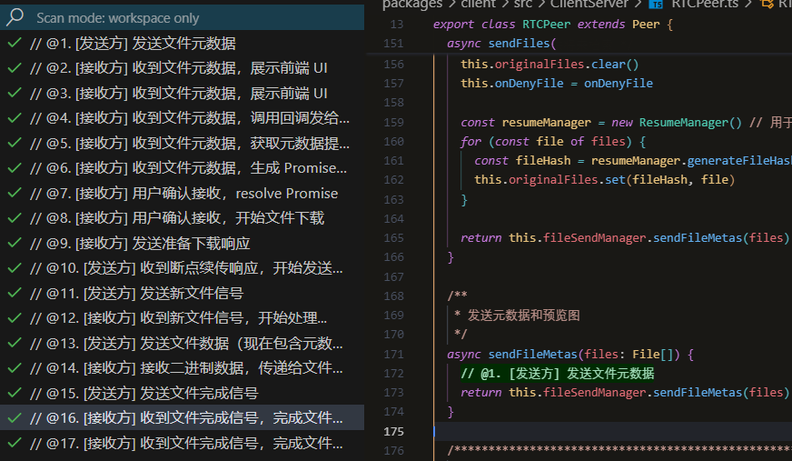

# 浏览器里的“隔空投送”：从零到一，我是如何实现 WebRTC 局域网文件传输的

## 📖 阅读本文，你将学会

你是否曾想过，在没有网络、没有U盘、甚至没有安装任何额外软件的情况下，如何将电脑上的一个大文件快速传到另一台电脑或手机上？苹果用户可能会会心一笑，说出“隔空投送”。但对于广大的 Windows 和 Android 用户来说，这似乎一直是个痛点。

这篇文章将带你深入我开发的开源项目 [Web-Share](https://github.com/beixiyo/web-share)，但我们不只是走马观花。读完本文，你将收获的不仅仅是一个文件传输工具的实现过程，更是一套解决复杂 Web 应用问题的实战思路：

*   **WebRTC 实战**：从连接建立到数据传输，掌握 WebRTC 的核心流程与关键 API。
*   **二进制数据处理**：学习如何巧妙地将元数据与二进制数据打包，解决 `RTCDataChannel` 的一大限制。
*   **性能优化**：理解并实现“背压”机制，防止数据发送过快导致连接崩溃。
*   **前端架构解耦**：通过发布订阅和 Promise，优雅地处理复杂异步流程和 UI 交互。
*   **断点续传设计**：从零设计一套可靠的断点续传机制，并保证数据的完整性。

准备好了吗？让我们一起，让浏览器再次伟大！

---

## 🔬 原理概述：浏览器之间的“鹊桥相会”

一句话概括，这个项目是基于 **WebRTC** 技术实现的。WebRTC (Web Real-Time Communication) 允许浏览器之间建立点对点（P2P）的直接连接，实现音视频或任意数据的实时传输。

但这里有一个“鸡生蛋，蛋生鸡”的问题：两个浏览器都不知道对方的网络地址（IP、端口），怎么建立连接呢？

这时候就需要一个“**婚姻介绍所**”——我们称之为**信令服务器 (Signaling Server)**。

它的作用很简单：
1.  浏览器 `A` 告诉“介绍所”：“我想认识 `B`，这是我的联系方式。”
2.  “介绍所”把 `A` 的联系方式转交给 `B`。
3.  `B` 同意后，也把自己的联系方式通过“介绍所”告诉 `A`。
4.  双方交换联系方式后，“介绍所”功成身退。`A` 和 `B` 开始私下直接通信，传输文件。



这个过程保证了我们的文件数据，自始至终都只在用户的设备之间进行端到端加密传输，服务器完全碰不到，实现了极致的**高效**与**安全**。

---

## 💡 探索之旅：编码中的挑战与解决方案

这部分是文章的核心。我将分享在开发过程中遇到的几个关键问题，以及我是如何思考并解决它们的。

### 问题一：茫茫人海（局域网）中，如何让设备发现彼此？

当你和朋友连着同一个 Wi-Fi，打开这个应用，你们会神奇地出现在对方的设备列表里（仅限本地开发局域网环境）。

> [截图占位符：应用主界面，显示了多个在线用户（如 Mac, Windows, Phone）的头像]

这背后是一个简单而巧妙的“**房间**”机制。

**解决方案：IP 网段分组**

当一个设备连接到信令服务器时，服务器会获取它的公网 IP 地址。在我的项目 `packages/server/src/Peer.ts` 文件中，我编写了 `getRoomIdFromIP` 方法。

```typescript
// packages/server/src/Peer.ts

class Peer {
  // ...
  private getRoomIdFromIP(ip: string): string {
    // ... (本地回环地址处理)

    /** 私有网络地址 - 按网段划分 */
    if (Peer.ipIsPrivate(ip)) {
      const parts = ip.split('.')
      // 192.168.x.x 网络 - 按前三段划分
      if (parts[0] === '192' && parts[1] === '168') {
        return `lan_192_168_${parts[2]}`
      }
      // 10.x.x.x 网络 - 按前两段划分
      if (parts[0] === '10') {
        return `lan_10_${parts[1]}`
      }
      // ... (其他私有网段处理)
    }

    /** 公网IP - 每个IP一个房间 */
    return `public_${ip.replace(/\./g, '_')}`
  }
  // ...
}
```
这个方法会分析客户端的 IP 地址，将处于同一个局域网子网（例如 `192.168.1.x`）的所有设备，都分配到同一个 `roomId`。这样，当有新设备加入时，服务器只需将它的信息广播给这个“房间”里的所有其他设备，就实现了自动发现。

当然，为了应对复杂的网络环境，项目还支持通过“二维码”或“6位房间码”来创建和加入临时房间，其本质也是为一次性会话创建一个唯一的 `roomId`。

### 问题二：WebRTC 连接建立的“三步走”

WebRTC 的连接过程充满了术语：SDP、Offer、Answer、ICE。听起来很复杂，但我们可以把它简化为“相亲三步走”。

**解决方案：Offer / Answer / ICE 模型**

1.  **发起方（A）的“求爱信” (Offer)**：用户 `A` 点击 `B` 的头像，浏览器会生成一份 `Offer`。这份 Offer 是一个符合 SDP (Session Description Protocol) 规范的文本，详细描述了 `A` 的通信能力（支持的编解码器、加密算法等）。然后 `A` 通过信令服务器将 `Offer` 发给 `B`。

2.  **接收方（B）的“回信” (Answer)**：`B` 收到 `Offer` 后，如果同意连接，就会生成一份对应的 `Answer`，同样是 SDP 格式，表示“你的条件我接受，我们可以开始沟通了”。`Answer` 也通过信令服务器回传给 `A`。

3.  **寻找“最佳约会路线” (ICE Candidates)**：在交换“信件”的同时，`A` 和 `B` 也在各自探索所有可能的网络路径，比如自己的内网IP、通过 STUN 服务器发现的公网IP等。这些路径被称为 `ICE Candidate`。双方会不断地通过信令服务器交换这些“候选路线”，并尝试互相“打洞”（NAT Traversal），直到找到一条能成功通信的最佳路径。

一旦路径建立，`RTCDataChannel`（数据通道）就会被打开，信令服务器的任务彻底结束，真正的文件传输开始了。

### 问题三：元数据和二进制，如何“一石二鸟”？

这是一个非常经典的问题。`RTCDataChannel` 的 `send()` 方法一次只能发送一种类型的数据：要么是字符串，要么是二进制（`ArrayBuffer` 等）。

当我需要发送一个文件块（二进制）时，如何同时告诉接收方这个块的元数据，比如：它属于哪个文件？是第几个块？偏移量是多少？

一个直观但糟糕的方案是“交叉发送”：先 `send()` 一个 JSON 字符串描述元数据，再 `send()` 文件块的二进制数据。这会导致发送次数翻倍，性能低下，且接收方需要维护复杂的状态机来配对元数据和数据，极易出错。

**解决方案：像打包快递一样，将元数据和二进制“粘”在一起**

我的思路是：**在发送前，将元数据和二进制数据打包成一个单一的 `ArrayBuffer` 进行发送。** 就像是把“货物”和“运单”一起放进一个快递包裹里。这个过程由 `packages/client/src/utils/handleFile/BinaryMetadataEncoder.ts` 完成，它的工作流程如下：

1.  **准备“运单”(Metadata)**：首先，我们将包含文件哈希、偏移量等信息的 JavaScript 对象，通过 `JSON.stringify()` 转换成字符串，再用 `TextEncoder` 转换成二进制的字节流（`Uint8Array`）。这就是我们的“运单”。
2.  **计算尺寸，准备“包裹”**：我们精确计算出最终“包裹”需要多大空间。总大小 = `“运单”长度所需空间` + `“运单”本身大小` + `“货物”本身大小`。然后创建一个这么大的 `ArrayBuffer` 作为包裹。
3.  **贴上“包裹说明”(Metadata Length)**：这是最关键的一步。我们在“包裹”的最前面，用固定的2个字节（`Uint16`）写入“运单”的实际长度。这2个字节就像是贴在快递箱上的说明，告诉收货员：“运单”有多长，从哪里开始是真正的“货物”。
4.  **打包**：依次将“运单”的二进制内容和“货物”（文件块）的二进制内容，填充到“包裹”中相应的位置。
5.  **发送**：将这个包含了所有信息的、结构完整的“包裹”(`ArrayBuffer`) 一次性发送出去。

这样，我们发送的每一个数据包都自带了“说明书”，其结构是：
`[“运单”长度 (2字节)] + [“运单”JSON字符串 (n字节)] + [“货物”文件块 (m字节)]`

接收方收到数据后，解码过程就是打包的逆操作：
1.  先读取前2个字节，得到“运单”的长度 `n`。
2.  再读取后面 `n` 个字节，就能得到完整的“运单”信息，并解析成元数据对象。
3.  剩下的所有内容，就是纯粹的“货物”——文件块数据。

这个方案将两次发送合并为一次，既高效又可靠，极大地简化了数据处理逻辑。

### 问题四：如何防止“快车”拖垮“慢车”？

想象一个场景：发送方是一台性能强劲的电脑，网络飞快；接收方是一台老旧的手机，处理速度慢。如果发送方不加节制地疯狂发送数据块，会发生什么？

数据并不会立刻通过网络发送出去，而是会先进入浏览器内部的一个“待发送缓冲区”。如果这个缓冲区被塞满（因为发送速度远大于网络传输和接收方处理速度），新的数据块就会无处安放，最终可能导致浏览器崩溃或连接中断。这就是所谓的“**背压**”（Back-pressure）问题。

**解决方案：基于 `bufferedAmount` 的智能流量控制**

为了解决这个问题，我利用了 `RTCDataChannel` 提供的一个属性：`bufferedAmount`。

*   **它是什么？** `bufferedAmount` 告诉我们当前有多少数据字节堆积在“待发送缓冲区”里，还没来得及通过网络发出去。
*   **为什么要检查？** 它可以实时反映网络的拥堵情况和接收方的处理能力。如果这个数值持续增高，说明我们发送得太快了。
*   **什么时候检查？** 在发送**每一个**文件块之前，我都会检查这个值。
*   **如何应对？** 当我发现 `bufferedAmount` 超过了一个我设定的安全阈值（比如16MB）时，我会暂停发送。我不会用 `setTimeout` 轮询，而是监听一个更智能的事件：`bufferedamountlow`。这个事件在浏览器成功发送掉一部分缓冲区数据，使其降低到阈值以下时自动触发。我用一个 `Promise` 来“等待”这个事件，一旦触发，`Promise` 完成，发送循环才会继续。

这套机制就像一个智能的水龙头，能感知下水道的排水速度。当下水道快堵塞时，会自动关小水流，等通畅后再开大，从而动态地将发送速度匹配到接收方的处理能力，极大地保证了文件传输的稳定性和可靠性。

### 问题五：文件预览是如何实现的？它和异步UI交互有何关联？

在发送文件前，接收方会弹出一个确认框，上面不仅有文件名、大小，甚至还有图片的预览图。用户点击“接受”或“拒绝”后，发送方才会继续或中止。

> [截图占位符：接收方弹出的文件接收确认框，上面显示了文件名、大小，还有一个图片预览]

**文件预览的“取巧”实现**

你可能会想，预览图是不是通过 WebRTC 发送的？最初我也是这么想的，但很快发现一个问题：`RTCDataChannel` 对单次发送的数据大小有限制。一张经过压缩的 Base64 缩略图也可能有几十KB，很容易超出限制，导致连接建立失败。

因此，更稳妥的方案是：**通过信令服务器来传递这份初始元数据。**

在 `FileSendManager` 中，当用户选择文件后，我会先为图片生成一个低质量的 Base64 缩略图，然后将它连同文件名、大小等元数据一起，通过更可靠的 WebSocket 信令服务器发送给接收方。当接收方用户点击“接受”后，我们才开始通过高速的 WebRTC `DataChannel` 传输真正的、巨大的文件块。

这正是“好钢用在刀刃上”：用信令服务器保证关键控制信息的可靠送达，用 WebRTC 保证海量数据的传输效率。

**用 `Promise` 解耦异步UI交互**

这里还有一个挑战：底层的 WebRTC 传输逻辑，如何“暂停”下来，等待用户的 UI 操作（点击“接受”或“拒绝”）？

我的解决方案是，利用 `Promise` 来创建一个“**遥控器**”，完美地解耦了数据逻辑与UI展现。

1.  **逻辑层需要“许可”**：当接收方的 `RTCPeer`（逻辑层）收到文件元数据后，它知道需要用户确认。但它不关心UI长什么样，它只做一件事：**创建一个“遥控器”（`Promise.withResolvers()`），并把这个遥控器（包含 `resolve` 和 `reject` 按钮）递交给上层（UI层）。** 然后，它就在原地 `await` 这个 `Promise`，相当于暂停等待遥控器的指令。

2.  **UI层接收“遥控器”并展示**：`useFileTransfer.ts`（UI层）拿到了这个“遥控器”，它的任务是弹出一个漂亮的确认框给用户看，然后静静地保管好这个遥控器。

3.  **用户按下“按钮”**：当用户在界面上点击“接受”按钮时，UI层的代码就会按下遥控器上的 `resolve` 按钮。如果用户点击“拒绝”，就按下 `reject` 按钮。

4.  **逻辑层响应“指令”**：逻辑层 `await` 的那个 `Promise` 终于收到了信号，从暂停状态中恢复过来。根据是 `resolve` 还是 `reject`，它就知道是该继续准备接收文件，还是通知对方传输已取消。

这个模式，就像给异步流程安装了一个可由UI控制的“暂停/播放开关”，使得底层的网络逻辑可以完全独立于上层的UI实现，极大地提升了代码的可读性和可维护性。

### 问题六：如何实现可靠的断点续传并保证数据完整性？

网络抖动、手滑关闭页面，是大文件传输的噩梦。断点续传是必备功能。

**解决方案：哈希识别 + IndexedDB 缓存 + 偏移量协商与校验**

1.  **哈希识别**：传输开始前，使用“文件名 + 文件大小”为任务生成一个唯一的 `fileHash`，作为“身份证”。

2.  **本地缓存**：接收方每收到一个**带有元数据**的数据块，就会将其存入浏览器的 `IndexedDB` 中。`ResumeManager.ts` 负责管理这些缓存，它像一个高效的仓库管理员。

3.  **偏移量协商**：当连接恢复，准备再次接收同一文件时（通过`fileHash`识别），接收方先查 `IndexedDB`，计算出已下载的最大连续偏移量。然后通过 `ResumeInfo` 消息告诉发送方：“请从第 `10485761` 个字节开始发。” 发送方收到后，就会从指定位置继续传输。

**数据完整性如何保证？**

这是断点续传的灵魂。如果缓存的数据是错乱的、有“空洞”的，那么最后拼接出的文件就是损坏的。

我在 `packages/client/src/utils/handleOfflineFile/ResumeManager.ts` 中做了关键处理：

```typescript
// packages/client/src/utils/handleOfflineFile/ResumeManager.ts
class ResumeManager {
  // ...
  async* getCachedChunksStream(fileHash: string): AsyncGenerator<ChunkInfo, void, unknown> {
    // ... 获取所有缓存块的 key，并按偏移量排序
    let sortedOffsets = chunkKeys
      .map(key => ({ key, offset: Number.parseInt(key.split('_').pop() || '0', 10) }))
      .sort((a, b) => a.offset - b.offset)

    // ======================
    // * 校验数据偏移连续性
    // ======================
    let offsetIndex = 0
    for (const { offset } of sortedOffsets) {
      if (offset !== offsetIndex++ * CHUNK_SIZE) {
        /** 数据块不连续！ */
        Log.error(`数据块不连续...放弃部分数据`)
        /** 只保留连续的部分 */
        sortedOffsets = sortedOffsets.slice(0, offsetIndex - 1)
        /** 删除无效的缓存 */
        this.deleteResumeCache(fileHash)
        break
      }
    }
    // ...
    /** 之后只 yield 连续部分的数据块 */
  }
  // ...
}
```

在从缓存中恢复数据时，我并不仅仅是读出所有数据块。我会对所有缓存块的偏移量进行**连续性校验**。如果发现偏移量不连续（例如，`0, 16384, 49152`，中间丢失了 `32768`），我会认为从断点处开始的缓存是不可靠的，**果断丢弃所有不连续的数据**，并只从最后一个连续的位置请求数据。

这种“宁缺毋滥”的设计，确保了最终文件的完整性和正确性。

---

## 🎨 UI 展示亮点

一个好的工具，体验必须流畅。

> [截图占位符：用户将文件拖拽到浏览器窗口，出现半透明的拖拽区域提示]
> **拖拽与粘贴**：支持直接将文件拖拽到浏览器窗口，或直接 `Ctrl + V` 粘贴剪贴板里的文件/截图/文本进行发送。

> [截图占位符：工具栏菜单，显示了“清理缓存”选项]
> **缓存管理**：提供手动清理过期缓存或全部缓存的功能，让用户可以掌控自己的磁盘空间。

---

## 🚀 开发与部署

### 本地开发

得益于 `pnpm` 和 `Monorepo` 架构，本地开发非常简单。

```bash
# 克隆项目
git clone https://github.com/beixiyo/web-share
cd web-share
# 安装依赖
pnpm i
# 一键启动所有服务 (client, server, common)
pnpm run dev
```

`pnpm run dev` 命令会并行启动客户端、信令服务器和公共模块的监视模式，任何代码改动都会实时生效。

### Docker 部署

项目已提供 `Dockerfile` 和 `docker-compose.yml`，一键部署到你的服务器。

**关键步骤：**
1.  修改 `docker-compose.yml` 文件。
2.  找到 `VITE_SERVER_URL` 环境变量，将其值修改为你的**服务器公网IP或域名**对应的 WebSocket 地址（例如 `wss://your.domain.com`）。这是为了让公网上的客户端能正确找到你的信令服务器。
3.  执行 `docker compose up -d`。

部署后，在两个不同设备上（最好在同一局域网）访问客户端地址，即可开始测试。

---

## 总结

WebRTC 是一个强大但充满挑战的技术。通过将复杂问题拆解为 **信令**、**连接**、**数据处理**、**UI交互** 四个维度，我们可以逐一攻克。这个项目不仅是一个文件传输工具，更是一次对现代 Web技术深度应用的探索。

希望这篇拆解能让你对“纯前端文件快递”有了全景式的理解。若你对项目感兴趣，欢迎访问 [GitHub 仓库](https://github.com/beixiyo/web-share) 给我一个 Star，或在 [Issue](https://github.com/beixiyo/web-share/issues) 中提出你的问题和想法，我们一起把浏览器的潜力拉满！
